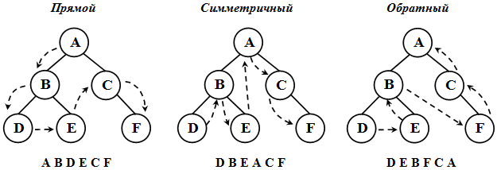
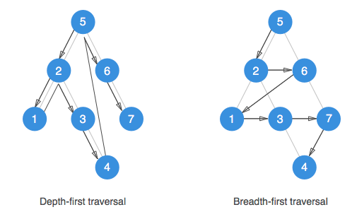
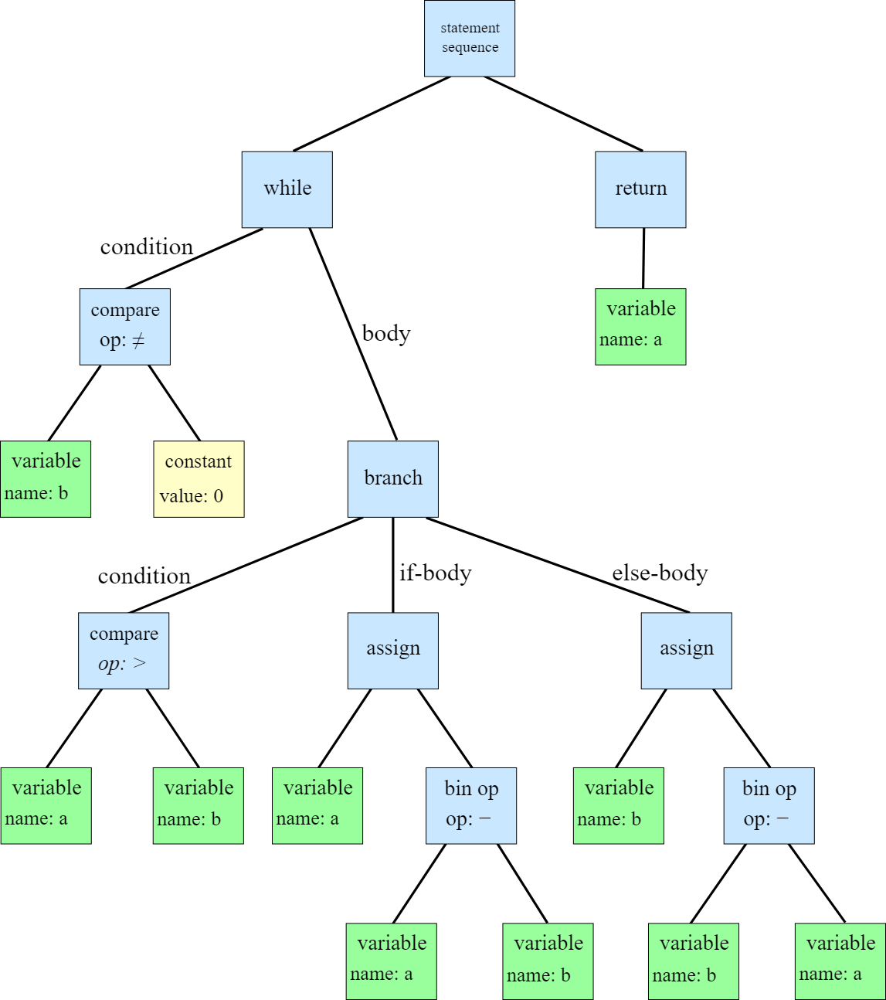

// вызывается при синтаксической ошибке
void yyerror (const char \*s) {
fprintf (stderr, "%s\n", s);
}

do {
yyparse();
} while (!feof(yyin));
fprintf(yyout, "return 0;\n}");
yyparse(): Это функция, автоматически генерируемая Yacc/Bison, которая запускает синтаксический анализатор. Она обрабатывает входные данные, считанные из файла, на который указывает yyin(указатель). Этот процесс включает в себя вызов функции yylex() (генерируемой Lex), которая разбивает входные данные на токены и возвращает их yyparse.

do { ... } while (!feof(yyin));: Это цикл, который продолжается до тех пор, пока не будет достигнут конец файла (EOF), указанного в yyin. feof() - это функция стандартной библиотеки C, которая проверяет, достигнут ли конец файла. Таким образом, цикл do-while гарантирует, что весь входной файл будет полностью проанализирован.

fprintf(yyout, "return 0;\n}");
добавляем в конец

// закрываем файлы
fclose(yyin);
fclose(yyout);



Объявления

Здесь располагаются объявления токенов и типов данных,
с которыми работает анализатор

%%
Правила грамматики

Здесь содержится описание грамматики в БНФ (Бэкус-Нуровская Форма). Правила
выглядят примерно следующим образом:

нетерминал: правило_1 {действия}
| правило_2 {действия}
...
;
%%

Эпилог

Сюда можно помещать код на языке Си как если бы это был обычный файл
исходного кода

%token  VAR END_VAR END_REPEAT
представляет начало блока объявления переменных, нет необходимости хранить какие-либо дополнительные данные кроме самого факта его появления.

LETTERS TYPE TYPES_LOGIC 
    a : INT;

LETTERS ASSIGN EXP SIGNS EX
    a := 

makefile
$^: Это автоматическая переменная в make, которая заменяется списком всех зависимостей цели. В данном случае это lex.yy.c y.tab.c.
-o $@: Опция -o используется для указания имени выходного файла в процессе компиляции. $@

y.tab.c: Этот файл содержит исходный код на C для парсера. Он создается автоматически Bison (или Yacc) на основе файла спецификации грамматики (обычно с расширением .y). В этом файле реализуется функция парсинга (чаще всего yyparse()), которая управляет процессом синтаксического анализа в соответствии с определенными в файле спецификации правилами.

y.tab.h: Этот заголовочный файл содержит определения, которые используются как парсером (в y.tab.c), так и лексическим анализатором (который обычно генерируется Flex). Основное содержание файла — это определения токенов, которые используются для взаимодействия между лексером и парсером. Лексер разбивает входные данные на токены, и каждый токен идентифицируется по уникальному коду, определенному в y.tab.h.

Дерево разбора (или синтаксическое дерево) — это структура данных, используемая в компиляторах и интерпретаторах для представления синтаксической структуры исходного кода программы в соответствии с формальной грамматикой языка программирования. Это дерево представляет собой иерархическую структуру, в которой каждый узел соответствует части кода.

Узлы: В дереве разбора узлы представляют конструкции языка программирования. Узлы могут быть:

    Терминальными: Это листья дерева, соответствующие фактическим токенам исходного кода (например, ключевым словам, идентификаторам, литералам).
    Нетерминальными: Это внутренние узлы, представляющие синтаксические правила грамматики (например, выражения, операторы, объявления).
    Корень: Корень дерева представляет всю программу или конструкцию верхнего уровня.

    Ветви: Ветви соединяют узлы и представляют отношения между различными частями программы. Например, ветвь может соединять узел, представляющий оператор if, с его условием и блоками кода.

Абстрактное синтаксическое дерево (АСД, англ. abstract syntax tree, AST) — конечное помеченное ориентированное дерево, в котором внутренние вершины сопоставлены (помечены) с операторами языка программирования, а листья — с соответствующими операндами. 

    
    
    